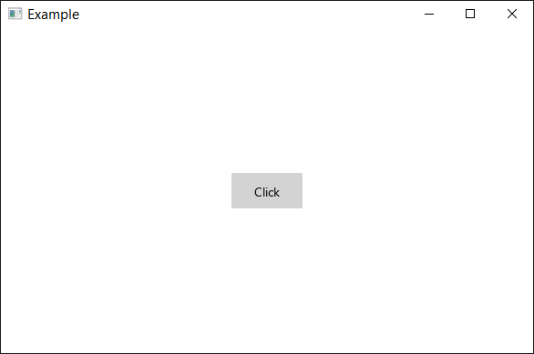

## What is Sgl?
Sgl is a modern, cross-platform UI framework built on top of C++20 and SDL3. Designed for developers who want to create native desktop applications with a clean, declarative API, Sgl combines the performance of native code with the productivity features of modern UI frameworks.

## Create a project
### Prerequisites
Before creating a Sgl project, ensure you have the following installed:
1. C++20 compatible compiler (MSVC 2022+, GCC 11+, Clang 14+).
2. [SDL3](https://github.com/libsdl-org/SDL/releases/tag/release-3.2.26), [SDL_image](https://github.com/libsdl-org/SDL_image/releases/tag/release-3.2.4), and [SDL_ttf](https://github.com/libsdl-org/SDL_ttf/releases/tag/release-3.2.2) development libraries.
3. [Premake](https://premake.github.io/) for project generation.

### Project Setup Steps
1. Clone the Sgl repository:
    ```
    git clone https://github.com/Dyikot/Sgl.git SglApp
    ```
2. Prepare dependencies folder:
    ```
    SglApp/
    └── Dependencies/
        ├── Include/     # SDL3, SDL_image, SDL_ttf headers
        └── Libraries/   # SDL3, SDL_image, SDL_ttf static libraries
    ```
3. Generate project files using Premake:
    ```
    premake5 vs2022    # For Visual Studio 2022
    premake5 gmake2    # For Makefiles (Linux/GCC)
    ```
4. Open the generated solution or build via command line:
    ```
    # Visual Studio
    msbuild Sgl.sln

    # Makefile (Linux)
    make
    ```

### Build Configuration
After running Premake, two projects are generated:
- Sgl – The framework library
- App – Your application project

Ensure your main.cpp includes the required headers:
```
#include <SDL3/SDL_main.h>
#include <Application.h>
```

### Runtime Dependencies
Copy these DLLs/shared libraries to your output directory `bin/App/Output/{Debug/Release}/`:
- SDL3.dll / libSDL3.so
- SDL_image.dll / libSDL_image.so
- SDL_ttf.dll / libSDL_ttf.so

## Configure application
The `Application` class serves as the central entry point and runtime manager for your Sgl application. It handles initialization of the SDL3 backend, manages the main event loop, and provides access to application-wide services such as resource management, styling, theming, and localization.

```c++
int main(int argc, char* argv[])
{
	Application app;
	app.MainWindow = New<MyWindow>();
	app.Run();

	return 0;
}
```

1. `Application app;` – Creates the application instance and initializes the framework.
2. `app.MainWindow = New<MyWindow>();` – Assigns your custom window class as the primary window. The `New<T>()` helper is Sgl's type-safe factory for creating UI objects with automatic memory management.
3. `app.Run();` – Enters the blocking event loop. This call returns only when the main window is closed.

The Application instance should typically be created once in main() and remain alive for the duration of the program.


## Configure window
The `Window` class represents a top-level application window. By inheriting from `Window`, you define the structure and behavior of your UI. Windows manage their own content tree, handle input events, and integrate with the application's layout and styling systems.

```c++
class MyWindow : public Window
{
public:
	MyWindow()
	{
		SetTitle("Example");
		SetResizable();

		auto button = New<Button>();
		button->SetContent("Click");
		button->SetPadding(Thickness(25, 10));
		button->SetVerticalAlignment(VerticalAlignment::Center);
		button->SetHorizontalAlignment(HorizontalAlignment::Center);

		SetContent(button);
	}
};
```

This example defines a custom window with a single centered button:
1. `SetTitle("Example")` – sets the text displayed in the window's title bar.
2. `SetResizable()` – enables the user to resize the window.
3. `Button` creation and configuration:
    - `New<Button>()` creates a managed button instance.
    - `SetContent("Click")` assigns the button's label text.
    - `SetPadding(Thickness(25, 10))` adds 25 px of horizontal and 10 px of vertical spacing inside the button, around its content.
    - Alignment properties center the button both vertically and horizontally within the available window space.
4. `SetContent(button)` – establishes the button as the root element of the window's visual tree. Since `Button` is a content control, it can host simple content like text; for complex layouts, you would typically set a panel (e.g., `StackPanel`, `Grid`) as the content instead.



## Next Steps
Now that you have a basic Sgl application running, explore these topics:
1. [Styling guide](styling.md) - Learn to create reusable styles with selectors and themes
2. [Data binding](data-binding.md) - Implement MVVM pattern with automatic UI synchronization