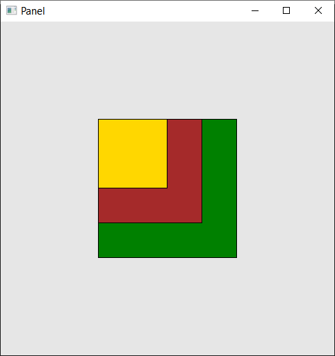
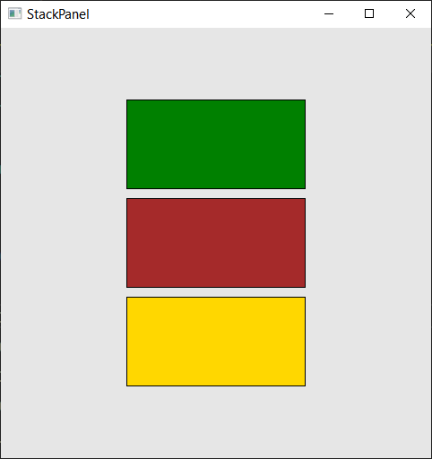
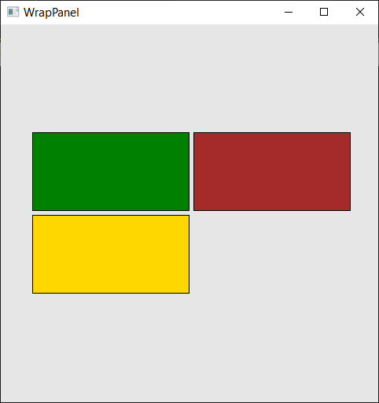
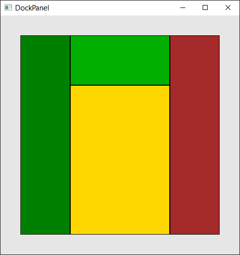
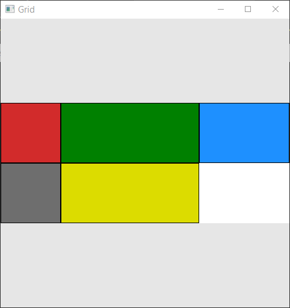
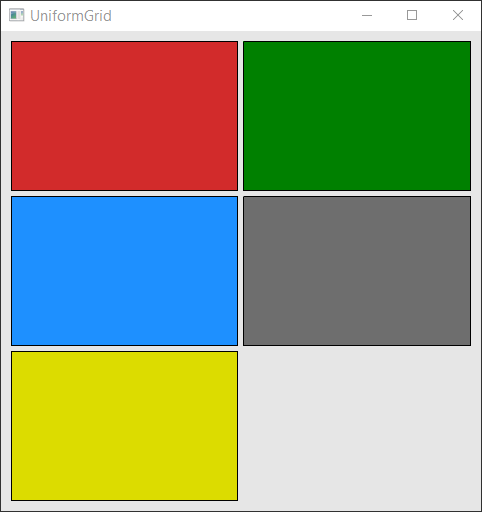
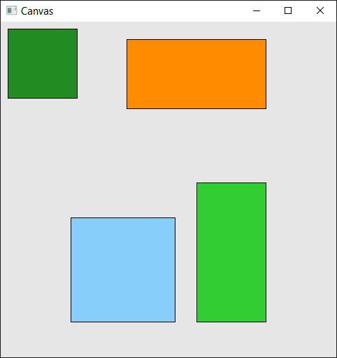

# Panels
Panels are container elements in a UI framework responsible for layout management. They define how child elements are arranged, sized, and positioned within a visual tree. Panels are fundamental building blocks for creating structured, responsive user interfaces.

## Panel
`Panel` is the base class for all layout containers in the framework. All panels store their child elements in a `UIElementsCollection` accessed via the Children field. Children in a Panel are arranged on top of each other, stacked in the order they are added.

Style selectors such as `Panel_NthChild`, `Panel_FirstChild`, and `Panel_LastChild` allow targeting children by position.

```c++
auto panel = New<Panel>();
panel->SetVerticalAlignment(VerticalAlignment::Center);
panel->SetHorizontalAlignment(HorizontalAlignment::Center);

std::pair<Size, Color> data[] =
{ 
	{ Size(200, 200), Colors::Green },
	{ Size(150, 150), Colors::Brown },
	{ Size(100, 100), Colors::Gold  }
};

for(auto [size, color] : data)
{
	auto child = New<Border>();
	child->SetBackground(color);
	child->SetWidth(size.Width);
	child->SetHeight(size.Height);
	panel->Children.Add(child);
}
```



## StackPanel
`StackPanel` arranges child elements in a single linear sequence, either vertically from top to bottom or horizontally from left to right. This makes it ideal for vertical lists, horizontal toolbars, sequential form fields, or any scenario where elements should flow in one direction without wrapping.

The panel offers `SetOrientation` to choose between `Vertical` (default) and `Horizontal` layout. The `SetSpacing` method applies uniform spacing between all children.

```c++
auto stackPanel = New<StackPanel>();
stackPanel->SetOrientation(Orientation::Vertical);
stackPanel->SetSpacing(10);
stackPanel->SetVerticalAlignment(VerticalAlignment::Center);
stackPanel->SetHorizontalAlignment(HorizontalAlignment::Center);

Color colors[] = { Colors::Green, Colors::Brown, Colors::Gold };

for(auto color : colors)
{
	auto child = New<Border>();
	child->SetBackground(color);
	child->SetWidth(200);
	child->SetHeight(100);
	stackPanel->Children.Add(child);
}
```



## WrapPanel
`WrapPanel` positions children sequentially in the primary orientation and automatically wraps remaining elements to the next line when space runs out. This behavior makes it well-suited for tag clouds, responsive button groups, gallery thumbnails, or any layout where the item count is dynamic and should adapt to available width.

Key configuration includes `SetOrientation` to set the primary flow direction, `SetVerticalSpacing` and `SetHorizontalSpacing` for independent row and column gaps. 

`SetMaxWidth`/`SetMaxHeight` constrain the panel and trigger wrapping at a specific point.

```c++
auto wrapPanel = New<WrapPanel>();
wrapPanel->SetOrientation(Orientation::Horizontal);
wrapPanel->SetVerticalSpacing(5);
wrapPanel->SetHorizontalSpacing(5);
wrapPanel->SetMaxWidth(400);
wrapPanel->SetVerticalAlignment(VerticalAlignment::Center);
wrapPanel->SetHorizontalAlignment(HorizontalAlignment::Center);

Color colors[] = { Colors::Green, Colors::Brown, Colors::Gold };

for(auto color : colors)
{
	auto child = New<Border>();
	child->SetBackground(color);
	child->SetWidth(200);
	child->SetHeight(100);
	wrapPanel->Children.Add(child);
}
```



## DockPanel
`DockPanel` aligns children to specific edges of the panel — `Top`, `Bottom`, `Left`, or `Right` with an option for the last child to fill all remaining space. This pattern is perfect for application shells with toolbars and status bars, master-detail views, or any layout where elements anchor to window edges.

The panel uses `SetLastChildFill` to control whether the final child occupies the remaining area. The static method `DockPanel::SetDock` assigns a docking edge to each child. Children should also use alignment to fill their docked region. Children are processed in the order they are added.

```c++
auto dockPanel = New<DockPanel>();
dockPanel->SetWidth(400);
dockPanel->SetHeight(400);
dockPanel->SetLastChildFill(true);
dockPanel->SetVerticalAlignment(VerticalAlignment::Center);
dockPanel->SetHorizontalAlignment(HorizontalAlignment::Center);

// Left Green
{
	auto child = New<Border>();
	child->SetBackground(Colors::Green);
	child->SetWidth(100);
	child->SetVerticalAlignment(VerticalAlignment::Stretch);
	DockPanel::SetDock(child, Dock::Left);
	dockPanel->Children.Add(child);
}

// Right Brown
{
	auto child = New<Border>();
	child->SetBackground(Colors::Brown);
	child->SetWidth(100);
	child->SetVerticalAlignment(VerticalAlignment::Stretch);
	DockPanel::SetDock(child, Dock::Right);
	dockPanel->Children.Add(child);
}

// Top LightGreen
{
	auto child = New<Border>();
	child->SetBackground(Colors::LightGreen);
	child->SetHeight(100);
	child->SetHorizontalAlignment(HorizontalAlignment::Stretch);
	DockPanel::SetDock(child, Dock::Top);
	dockPanel->Children.Add(child);
}

// Bottom Gold
{
	auto child = New<Border>();
	child->SetBackground(Colors::Gold);
	child->SetHorizontalAlignment(HorizontalAlignment::Stretch);
	child->SetVerticalAlignment(VerticalAlignment::Stretch);
	DockPanel::SetDock(child, Dock::Bottom);
	dockPanel->Children.Add(child);
}	
```



## Grid
`Grid` arranges children in a flexible two-dimensional matrix of rows and columns, supporting fixed pixel sizes, auto-sizing to content, and proportional star sizing. This versatility makes Grid the go-to choice for data entry forms, dashboards, complex responsive layouts, or any scenario requiring precise two-dimensional alignment.

Column and row sizes are defined using space-separated strings like "100 * auto" for columns or "100 100" for rows. Fixed values set pixel sizes, `*` shares remaining space proportionally, and `auto` sizes to content. Definition can be set via `SetColumnDefinitions` and `SetRowDefinitions` methods. Children are positioned using the static methods `Grid::SetRow` and `Grid::SetColumn` with zero-based indexing. Rows and columns can also be merged using `SetRowSpan` и `SetColumnSpan`.

```c++
auto grid = New<Grid>();
grid->SetHorizontalAlignment(HorizontalAlignment::Center);
grid->SetVerticalAlignment(VerticalAlignment::Center);
grid->SetColumnDefinitions("100 * auto");
grid->SetRowDefinitions("100 100");
grid->SetBackground(Colors::White);
grid->Styles.Add(Selector().OfType<Grid>(), Panel_NthChild(3))
	.Set(Border::WidthProperty, 150);

Color colors[] =
{
	Colors::Red,
	Colors::Green,
	Colors::Blue,
	Colors::Grey,
	Colors::Yellow
};

int i = 0;
for(auto color : colors)
{
	auto child = New<Border>();
	child->SetHorizontalAlignment(HorizontalAlignment::Stretch);
	child->SetVerticalAlignment(VerticalAlignment::Stretch);
	child->SetBackground(color);
	grid->Children.Add(child);
	Grid::SetRow(child, i / 3);
	Grid::SetColumn(child, i % 3);

	i++;
}
```



## UnitformGrid
`UniformGrid` arranges children in a grid where all cells have identical size, automatically distributing available space equally among them. This consistent sizing makes it ideal for calendars, image galleries, game boards, icon grids, or any layout requiring uniform cell dimensions.

Configuration is straightforward: `SetRows` and `SetColumns` define the grid dimensions, `SetRowSpacing` and `SetColumnSpacing` control gaps between cells. Children are placed automatically left-to-right, top-to-bottom without manual row or column assignment.

```c++
auto uniformGrid = New<UniformGrid>();
uniformGrid->SetRows(3);
uniformGrid->SetColumns(2);
uniformGrid->SetRowSpacing(5);
uniformGrid->SetColumnSpacing(5);
uniformGrid->SetMargin(Thickness(10));
uniformGrid->SetHorizontalAlignment(HorizontalAlignment::Stretch);
uniformGrid->SetVerticalAlignment(VerticalAlignment::Stretch);

Color colors[] =
{
	Colors::Red,
	Colors::Green,
	Colors::Blue,
	Colors::Grey,
	Colors::Yellow
};

for(auto color : colors)
{
	auto child = New<Border>();
	child->SetHorizontalAlignment(HorizontalAlignment::Stretch);
	child->SetVerticalAlignment(VerticalAlignment::Stretch);
	child->SetBackground(color);
	uniformGrid->Children.Add(child);
}
```



## Canvas
`Canvas` provides absolute positioning of children using explicit coordinate values, with no automatic layout behavior. This low-level control suits drawing applications, animations, custom diagrams, pixel-perfect layouts, or scenarios where you need full manual control over element placement.

Positioning uses static methods: `Canvas::SetTop`, `SetBottom`, `SetLeft`, and `SetRight` place a child relative to the corresponding canvas edge. Because Canvas performs no automatic layout, children do not affect each other's position or size, and explicit element size are typically required for visibility.

```c++
auto canvas = New<Canvas>();
canvas->SetVerticalAlignment(VerticalAlignment::Stretch);
canvas->SetHorizontalAlignment(HorizontalAlignment::Stretch);

{
	auto child = New<Border>();
	child->SetBackground(Colors::ForestGreen);
	child->SetWidth(100);
	child->SetHeight(100);
	Canvas::SetTop(child, 10);
	Canvas::SetLeft(child, 10);
	canvas->Children.Add(child);
}

{
	auto child = New<Border>();
	child->SetBackground(Colors::Orange);
	child->SetWidth(200);
	child->SetHeight(100);
	Canvas::SetTop(child, 25);
	Canvas::SetRight(child, 100);
	canvas->Children.Add(child);
}

{
	auto child = New<Border>();
	child->SetBackground(Colors::LimeGreen);
	child->SetWidth(100);
	child->SetHeight(200);
	Canvas::SetBottom(child, 50);
	Canvas::SetRight(child, 100);
	canvas->Children.Add(child);
}

{
	auto child = New<Border>();
	child->SetBackground(Colors::LightSkyBlue);
	child->SetWidth(150);
	child->SetHeight(150);
	Canvas::SetBottom(child, 50);
	Canvas::SetLeft(child, 100);
	canvas->Children.Add(child);
}
```

